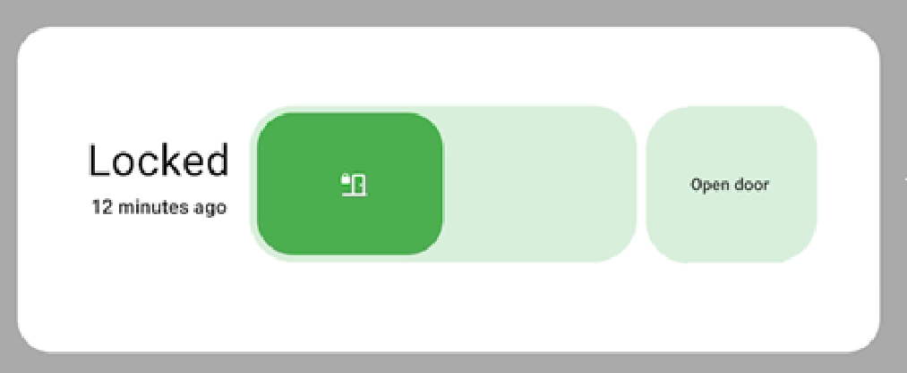

# Door Release Card

[](https://github.com/42bios/door-release-card/actions/workflows/ci.yml)
[](https://github.com/42bios/door-release-card/actions/workflows/hacs-validate.yml)

[](https://github.com/42bios/door-release-card/releases)

Custom Lovelace card for Home Assistant to safely trigger a door release workflow with a clear, two-step interaction model.

## Preview



## Background Idea

Typical "open door" actions are too easy to trigger accidentally.  
This card adds an intentional safety flow:

1. Arm by sliding the knob to the right.
2. Confirm by pressing `Open door`.

This reduces accidental clicks while keeping the UI fast and clear for daily use.

## Highlights

- Slide-to-arm interaction
- Dedicated confirmation button (`Open door`)
- Status and last opening text
- Smooth slider return animation
- Visual editor support (`door-release-card-editor`)
- Optional simulation mode for testing
- Fixed dashboard footprint (stable layout)

## How It Works

The card has a simple state machine:

- `locked`: normal resting state
- `unlocked` (armed window): slider is right, open can be confirmed
- `open`: contact entity reports door open
- `missing`: contact entity not found (if not treated as locked)

Behavior:

1. User drags slider right.
2. Card enters armed window for `arm_timeout`.
3. `Open door` is enabled and executes the configured script/service.
4. Slider returns left automatically (`slider_return_ms`) or after timeout.
5. Status text shows `Last opening Xm ago` (or `Xh Ym ago`).

## HACS Installation (Recommended)

[](https://my.home-assistant.io/redirect/hacs_repository/?owner=42bios&repository=door-release-card&category=plugin)

1. Open HACS in Home Assistant.
2. Go to `Dashboard`.
3. Open menu (three dots) -> `Custom repositories`.
4. Repository URL: `https://github.com/42bios/door-release-card`
5. Category: `Dashboard`
6. Install `Door Release Card`.
7. Add resource if needed:
   - URL: `/hacsfiles/door-release-card/door-release-card.js`
   - Type: `module`

## Manual Installation

1. Copy `door-release-card.js` to `<config>/www/door-release-card.js`.
2. Add Lovelace resource:
   - URL: `/local/door-release-card.js`
   - Type: `module`

## Basic Configuration

```yaml
type: custom:door-release-card
contact_entity: binary_sensor.haustuer_kontakt
open_script: script.automatische_turoffnung
arm_timeout: 10
unlock_display_timeout: 5
slider_return_ms: 900
open_button_label: Open door
```

## Configuration Options

- `contact_entity`: binary sensor for door contact
- `open_script`: script to trigger door opening
- `open_action.service`: alternative to script call
- `arm_timeout`: seconds the card stays armed
- `unlock_display_timeout`: status display timeout in seconds
- `slider_return_ms`: slider return animation duration
- `contact_open_state`: state string treated as open (default `on`)
- `treat_missing_as_locked`: fallback behavior for missing contact entity
- `simulation_mode`: enables local simulation controls
- `label_*`: custom labels for card states

## Repository Layout

- `door-release-card.js` - card implementation
- `hacs.json` - HACS metadata
- `.github/workflows/hacs-validate.yml` - HACS validation
- `.github/workflows/ci.yml` - syntax and file checks
- `.github/workflows/release.yml` - tag-based GitHub release

## Notes

- The card currently uses a fixed dashboard footprint for predictable visuals.
- Recommended for security-relevant door actions with explicit user confirmation.

## License

MIT - see [LICENSE](LICENSE).
