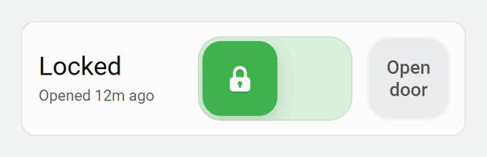

# Door Release Card

[](https://github.com/42bios/door-release-card/actions/workflows/ci.yml)
[](https://github.com/42bios/door-release-card/actions/workflows/hacs-validate.yml)

[](https://github.com/42bios/door-release-card/releases)

Custom Lovelace card for Home Assistant to safely trigger a door release workflow with a clear, two-step interaction model.

## Preview

<p align="center">
  <picture>
    <source media="(prefers-color-scheme: dark)" srcset="assets/door-release-card-dark.gif">
    
  </picture>
</p>

## Background Idea

Typical "open door" actions are too easy to trigger accidentally.  
This card adds an intentional safety flow:

1. Arm by sliding the knob to the right.
2. Confirm by pressing `Open door`.

This reduces accidental clicks while keeping the UI fast and clear for daily use.

## Highlights

- Slide-to-arm interaction with live feedback: sliding only enables the button, the door stays locked; while dragging, the `Open door` button turns from grey to green step by step
- The lock opens only when the door is actually released (red), and closes again afterwards
- Dedicated confirmation button (`Open door`)
- Status and last opening text
- Smooth slider return animation and soft color transitions between states
- English and German, follows the Home Assistant language automatically
- Simple visual editor: entity pickers, language, and collapsible sections for timing, texts and advanced options
- Optional simulation mode for testing
- Compact layout within the standard 2-row card height; the slider and square `Open door` button never shrink, on narrow cards the status text gives way first
- Follows the Home Assistant theme (light and dark mode)
- Keyboard accessible: focus the knob and press `Enter`/`→` to arm, `Esc`/`←` to disarm
- Shows an error in the status line if the open service call fails
- Lightweight: DOM is built once and only updated when the configured entities change

## How It Works

The card has a simple state machine:

- `locked`: normal resting state
- `armed`: slider is right, the door is still locked, `Open door` is enabled for `arm_timeout`
- `unlocked`: `Open door` was pressed, the door is released
- `open`: contact entity reports door open
- `missing`: contact entity not found (if not treated as locked)

Behavior:

1. User drags slider right.
2. The door stays locked; `Open door` turns green and is enabled for `arm_timeout`.
3. Pressing `Open door` executes the configured script/service; the card turns red and the lock opens.
4. Slider returns left automatically (`slider_return_ms`) or after timeout.
5. Status text shows `Opened Xm ago` (or `Xh Ym ago`).

## HACS Installation (Recommended)

[](https://my.home-assistant.io/redirect/hacs_repository/?owner=42bios&repository=door-release-card&category=plugin)

1. Open HACS in Home Assistant.
2. Go to `Dashboard`.
3. Open menu (three dots) -> `Custom repositories`.
4. Repository URL: `https://github.com/42bios/door-release-card`
5. Category: `Dashboard`
6. Install `Door Release Card`.
7. Add resource if needed:
   - URL: `/hacsfiles/door-release-card/door-release-card.js`
   - Type: `module`

## Manual Installation

1. Copy `door-release-card.js` to `<config>/www/door-release-card.js`.
2. Add Lovelace resource:
   - URL: `/local/door-release-card.js`
   - Type: `module`

## Basic Configuration

```yaml
type: custom:door-release-card
contact_entity: binary_sensor.haustuer_kontakt
open_script: script.automatische_turoffnung
arm_timeout: 10
unlock_display_timeout: 5
slider_return_ms: 900
```

## Configuration Options

- `language`: `en`, `de` or omit for automatic (Home Assistant UI language)
- `contact_entity`: binary sensor for door contact
- `open_script`: script to trigger door opening
- `open_action.service`: alternative to script call (`domain.service`)
- `open_action.data` / `open_action.target`: optional service data and target
- `arm_timeout`: seconds the card stays armed
- `unlock_display_timeout`: status display timeout in seconds
- `slider_return_ms`: slider return animation duration
- `arm_threshold`: how far the knob must be dragged to arm (`0.3`–`0.95`, default `0.5`)
- `contact_open_state`: state string treated as open (default `on`)
- `treat_missing_as_locked`: fallback behavior for missing contact entity
- `simulation_mode`: enables local simulation controls
- `label_locked`, `label_unlocked`, `label_open`, `label_missing`: custom labels for card states (override the built-in English/German texts)
- `label_armed`: label while the button is enabled (defaults to `label_locked`, since the door is still locked)
- `open_button_label`, `last_opened_prefix`, `missing_detail_text`: custom texts

## Repository Layout

- `door-release-card.js` - card implementation
- `hacs.json` - HACS metadata
- `.github/workflows/hacs-validate.yml` - HACS validation
- `.github/workflows/ci.yml` - syntax and file checks
- `.github/workflows/release.yml` - tag-based GitHub release

## Notes

- Controls keep a fixed size. Below ~320 px card width the status text is hidden; the state is still shown by the knob color and lock icon.
- Recommended for security-relevant door actions with explicit user confirmation.

## License

MIT - see [LICENSE](LICENSE).
